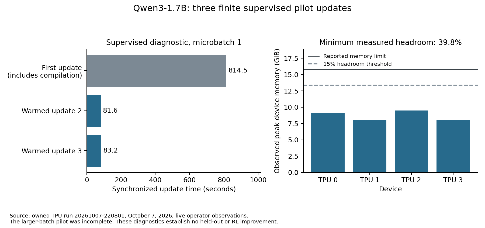

# Knowing When to Switch

Choosing a known value from a few options should require less work than solving a multi-step problem. If a necessary fact is missing, a quick guess and a long explanation can both fail. Sometimes the useful next step is to ask for that fact.

This project asks whether one small model can learn those choices: make a typed decision, answer directly, reason, or gather context before deciding. There are three modes—JEV, direct and ordinary chain-of-thought. Clarification and lookup are actions within them.

The prototype uses the complete [Qwen3-1.7B](https://huggingface.co/Qwen/Qwen3-1.7B) backbone and its language head. Shared LoRA adapters serve all three paths. A small attention head scores candidates, and three learned token rows select the mode. Emitting `<mode:jev>` stops language decoding and invokes that head. A mode token is a control signal, not evidence of good judgment.

Each candidate is encoded with observed context in an isolated branch. Positions reset, and candidates compare only inside a head without candidate-position embeddings. Moving a candidate should move its probability with it. Four candidates still entail four branch encodings: short output alone does not prove lower latency or compute.

The decision design is informed by [the JEV-style Qwen implementation](https://github.com/avbiswas/bev-train). Adaptive thinking already has substantial prior work, including [Think Only When You Need](https://arxiv.org/abs/2505.14631) and [AdaptThink](https://arxiv.org/abs/2505.13417). Qwen3 itself supports thinking and non-thinking operation. The question here is narrower: can a shared generative and typed-decision model learn useful transitions within a task?

## What actually worked

The original supervised run completed 438 optimizer updates on four TPU devices. Its best retained checkpoint was selected at step 150 by validation loss. Training completion and decreasing loss do not establish held-out accuracy.

One saved rollout provides a concrete example. The task withholds a numeric record value. The SFT model requests a controlled lookup in direct mode, receives **1,912**, emits JEV, and selects **1,912** from four candidates. It uses 19 generated tokens. An always-direct baseline also answers that fixture correctly, using 35 tokens. Candidate encoding and the decision head still cost computation, so this example cannot establish a latency advantage.

The [saved demonstration](demo-record.json) contains modes, actions, evidence, candidate probabilities and the answer. It is a replay of a recorded rollout, not newly executed inference or live web research. Learned JEV → CoT and CoT → JEV demonstrations remain unestablished. Controller tests with supplied actions do not count as learned routing.

## Where reinforcement learning failed

A verified RL checkpoint shows one finite update that changed 224 LoRA tensors and the mode embeddings. Its frozen reference matched SFT. The decision head did not change in that warmup update. This establishes a real policy update, not improved reasoning, decision accuracy or routing.

Subsequent attempts failed. One continuation's saved step-2 mode rows contained 18 NaNs; an integrity check showed the affected storage had downloaded correctly. That checkpoint is excluded from recovery.

The final PyTorch/XLA pilot restored finite state on all four replicas. Its 16 rollouts executed without environment errors, and some reward groups had variation. Likelihoods and losses passed finite checks; every replica completed backward. The next failure was the post-update parameter/optimizer-state guard. No new update was accepted.

The logs do not separately identify reduced gradients and the optimizer's resulting tensors. They cannot establish an AdamW bug, a hardware fault or the precise numerical mechanism. The honest diagnosis is an unresolved failure between distributed reduction and updated state. The guard prevented publication of another invalid checkpoint.

Only four completed context-acquisition examples survived the original comparison. SFT switching, the evaluated finite RL policy and always-direct answered those fixtures correctly. Four examples do not establish an RL gain or represent all six behaviors.

## Repairing the experiment

The recovery uses a pinned Tunix/JAX Qwen implementation with a custom mixed-action learner. A JEV decision contributes its categorical log probability; it is never represented as an invented language token. Prompts, tool responses and padding receive no policy loss. Actor and reference states share a frozen backbone and remain separate on device.

The update sequence exposes local gradients, FP32 averaged gradients, global norm clipping, AdamW, updated parameters and optimizer moments. Invalid state terminates the attempt with tensor diagnostics. There is no NaN-to-zero repair or repeated retry of a failed update.

The task also needed repair. Visible prompts must not prescribe asking or looking up the answer. Clarification must request the advertised missing field; an arbitrary question must not automatically reveal it. Tool availability depends on public information. JEV can choose answer, defer, ask or lookup. Deferring leaves the next mode for the model to choose.

The recovery dataset has 1,536 corrective SFT episodes, 120 validation episodes and 600 sealed test episodes. Source/context variants stay together, and template families differ across splits. The provenance audit reused 252 verified original public GSM8K training examples and imported no private teacher completions. Paired tasks vary whether useful evidence is present or missing; unnecessary tool requests provide a control. These remain arithmetic and context fixtures, not proof of broad reasoning or open-web competence. Split isolation does not prove absence of pretraining exposure.

At this draft's current checkpoint, 109 reference/control tests pass. The first complete locked Linux environment passed 12 numerical and ten protocol checks. Full 1.7B probability parity passed the fixed 0.001 tolerance. Fresh acceptance after the compiler and connection repairs passed 13 numerical and ten protocol checks, plus full-model parity. This validates the conversion; it is not an accuracy or performance result.

The first Tunix TPU pilot then passed its numerical suite and three disposable full-model supervised updates. All trainable components changed. The first update took 13.6 minutes; two warmed updates took about 82 seconds each, with at least 39.8% measured device-memory headroom. A larger-batch compilation stopped responding to remote health checks. Host-memory pressure is a plausible explanation, but an OOM and another numerical failure were not established. The owned TPU was deleted and its absence verified. New corrective SFT and real full-model GRPO remain unfinished.

The first-update timing includes compilation and execution. The chart describes one repeated supervised diagnostic batch, not test accuracy or an RL improvement. [Its source record](recovery-pilot-report.json) identifies which values were observed live and which reports were preserved completely.

The next repair replaces candidate-by-candidate expansion of the backbone graph with a bounded loop and reduces repeated host dispatch for gradients and optimizer checks. Fresh locked Linux acceptance passed 13 numerical checks, ten protocol checks and full-model probability parity on October 8. The full-model reference needed Linux-local weight storage and permitted swap after two memory-limited local attempts failed. The original tolerance stayed fixed. The compiler repair is an engineering hypothesis awaiting a TPU measurement, not a demonstrated speedup.

## Measuring the question honestly

The cumulative ceiling is now **$120**, including prior attempts. The historical conservative estimate was **$62.11**. The first Tunix pilot adds **$4.13**, bringing the bound to **$66.24**; evaluation funds remain protected. These are bounds, not reconciled bills. [TPU pricing](https://cloud.google.com/tpu/pricing) requires accounting for the whole slice, including setup, compilation, uploads and verified deletion. Remaining money in the total budget does not automatically extend a stage's authorized allowance.

The planned comparison includes native Qwen thinking/non-thinking, corrected SFT and RL switching, fixed modes, and validation-selected confidence switching. Trained policies receive the same tools, observations and context capacity. Always-JEV's inability to generate reasoning is an explicit capability restriction.

Test settings and IDs are frozen before opening outcomes. Reports will include grounded accuracy by behavior, failures, calibration, generated and candidate tokens, synchronized warmed latency, cold-call overhead and costs. Accuracy intervals and paired source-group comparisons accompany measurements. One training seed is exploratory.

A negative result is useful if it is reproducible. We currently have a supervised prototype, retained weights, one narrow learned demonstration, real but unstable RL attempts, and a recovery implementation under validation. We do not yet have evidence that switching improves the accuracy–compute tradeoff.

[The code](https://github.com/TinevimboMusingadi/knowing-when-to-think-fast-slow) and [postmortem](../POSTMORTEM.md) preserve that distinction. The next claim must come from a stable update and a fair comparison, rather than the appeal of the idea.
